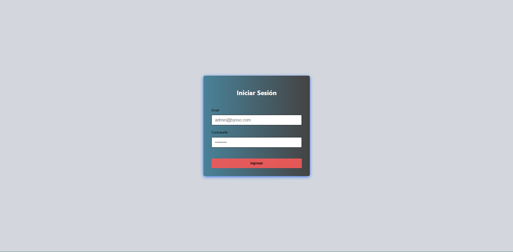
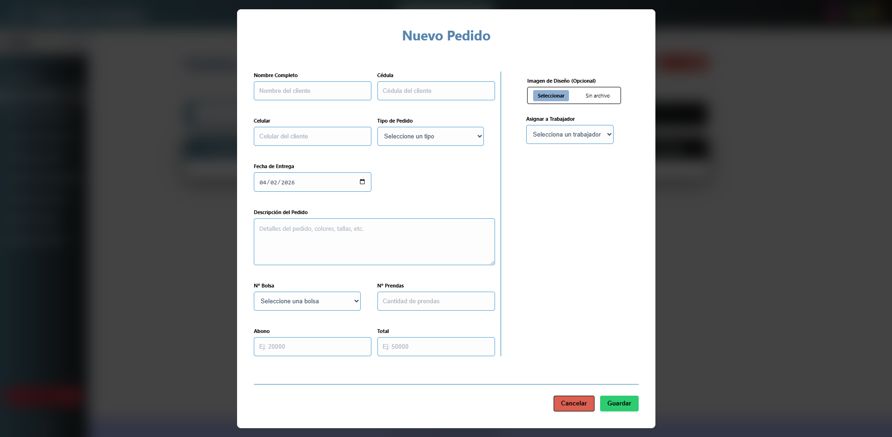

# 🧵 Bysso: Gestión Logística Textil
**Digitalización y optimización de procesos para la industria de estampados y bordados.**

Este proyecto es un caso de estudio real donde transformé procesos manuales en una plataforma Fullstack robusta, escalable y actualmente operativa en producción. 

---

## 🛠️ Stack Tecnológico

| Capa | Tecnología |
| :--- | :--- |
| **Frontend** | React (Vite) para una interfaz ágil y reactiva. |
| **Backend** | NestJS (Node.js) bajo arquitectura modular y SOLID. |
| **Base de Datos** | PostgreSQL + Prisma ORM para gestión de datos persistentes. |
| **Infraestructura** | Despliegue en DigitalOcean sobre servidor Ubuntu (Linux). |
| **DevOps** | Control de versiones con Git Flow (18 ramas de desarrollo). |

---

## 📸 Arquitectura del Sistema

### 🔐 Seguridad y Autenticación

*Implementación de seguridad JWT para el control de acceso, garantizando que la información operativa esté protegida.*

### 📋 Gestión de Pedidos y Producción

*Formulario dinámico diseñado para capturar especificaciones técnicas de bordado y estampado, eliminando el error humano.*

### 🧭 Navegación Estructural (Sidebar)
*Arquitectura modular que centraliza los módulos de pedidos, usuarios e inventario, optimizando el flujo de trabajo diario.*

### 📦 Control de Insumos (Lógica de Negocio)

*Módulo especializado para la trazabilidad de bolsas entregadas por pedido, resolviendo el problema crítico de pérdida de suministros.*

### 👥 Administración de Usuarios

*Panel administrativo para la gestión de roles y personal, permitiendo el crecimiento operativo de la empresa.*

---

## ⚙️ Backend & API RESTful (NestJS)

El servidor NestJS fue diseñado bajo principios de **Clean Code**. La API gestiona de forma eficiente la comunicación entre el cliente y la base de datos PostgreSQL.

### Mapeo de Endpoints en Producción

> **Evidencia Técnica:** Logs del servidor en operación. Se observa el mapeo exitoso de rutas RESTful (GET, POST, PATCH, DELETE) y la correcta inicialización del sistema en el entorno de producción.

---

## 📉 Evolución del Desarrollo (Git Flow)

El desarrollo se gestionó mediante un historial de versiones profesional, permitiendo una transición segura desde la arquitectura inicial hasta el despliegue final.

### Resumen de Actividad y Repositorio

*Vista general del repositorio donde se evidencia la constancia del desarrollo, el volumen total de commits realizados y la gestión estratégica de las 18 ramas que componen el proyecto.*

### Hitos de Commits
* **Fase de Cimentación:** 
*Configuración de Prisma, esquemas de base de datos y arquitectura base del servidor.*
* **Fase de Producción:** 
*Refactorización para despliegue, gestión de variables de entorno (.env) y optimización final.*

---

## 💡 Buenas Prácticas y Escalabilidad
* **TypeScript:** Uso de tipado estricto para un código mantenible y libre de errores en tiempo de ejecución.
* **Despliegue Real:** Configuración de entorno Linux en la nube con administración remota vía **MobaXterm**.
* **Modularidad:** Backend desacoplado por módulos independientes, facilitando el mantenimiento y la escalabilidad del software.

---

### 📩 Contacto
* **Email:** [tibesbotipa@gmail.com]
